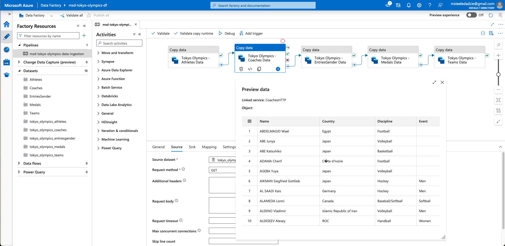
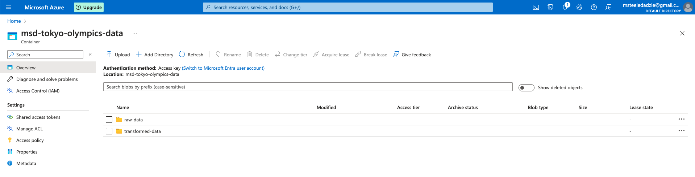
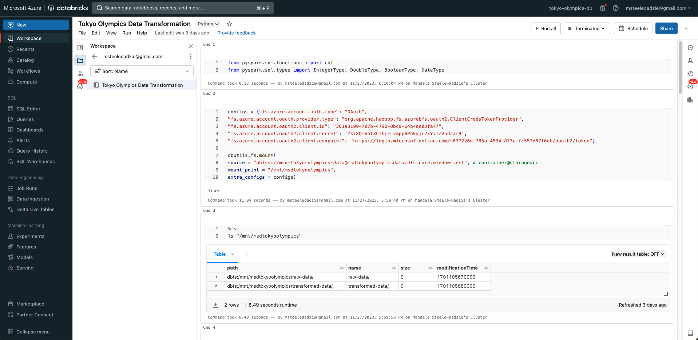
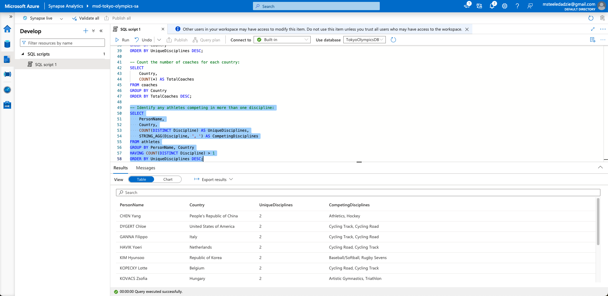

# 2020 Tokyo Olympics Azure Data Pipeline

This project is an end-to-end data pipeline that pulls 2020 Tokyo Olympics data stored in GitHub into Microsoft Azure via an Azure Data Factory. The data is then transformed with Databricks and stored in Azure Gen 2 Data Lakes before being analyzed via Azure Synapse.

Data forked and project composed with aid from tutorial ["Olympic Data Analytics | Azure End-To-End Data Engineering Project"](https://www.youtube.com/watch?v=IaA9YNlg5hM) by Darshil Parmar.

### Azure Data Factory

### Azure Storage Container

### Databricks Transformation

### Azure Synapse Analysis

